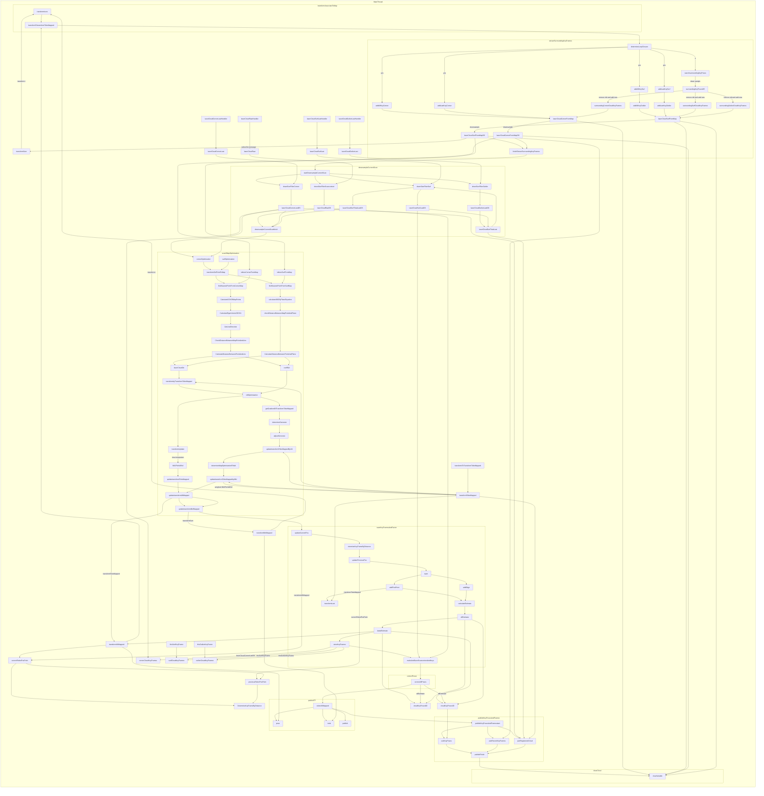

```mermaid
graph TB
    %%subgraph Thread1
    %%    performLoopClosure
    %% end


    %%subgraph Thread2
    %%    visualizeMapThread
    %%end

    subgraph MainThread
        direction TB
        subgraph transformAssociateToMap
            direction TB
            transformIncre --> transformTotransformTobeMapped
        end
        transformBefMapped --transform to-->transformIncre
        transformSum --transform to--> transformIncre
        transformAftMapped ---> transformTotransformTobeMapped
        transformToTransformTobeMapped ---> transformTobeMapped

        subgraph extractSurroundingKeyFrames
            direction TB
            determineLoopClosure --yes--> addAllKeyCorner --> laserCloudCornerFromMap
            determineLoopClosure --yes--> addAllKeySurf --> addAllKeyOutlier --> laserCloudSurfFromMap
            determineLoopClosure --yes--> addLastKeyCorner --> laserCloudCornerFromMap
            determineLoopClosure --yes--> addLastKeySurf --> addLastKeyOutlier --> laserCloudSurfFromMap
            determineLoopClosure --no--> searchsurroundingKeyPoses --down sample--> surroundingKeyPosesDS
            surroundingKeyPosesDS --remove old and add new-->surroundingCornerCloudKeyFrames --> laserCloudCornerFromMap
            surroundingKeyPosesDS --remove old and add new-->surroundingSurfCloudKeyFrames --> laserCloudSurfFromMap
            surroundingKeyPosesDS --remove old and add new-->surroundingOutlierCloudKeyFrames --> laserCloudSurfFromMap 
            laserCloudSurfFromMap --downsample--> laserCloudSurfFromMapDS --> finishExtractSurroundingKeyFrames
            laserCloudCornerFromMap --downsample--> laserCloudCornerFromMapDS --> finishExtractSurroundingKeyFrames
        end
        transformTotransformTobeMapped --> determineLoopClosure

        subgraph downsampleCurrentScan
            direction TB
            startDownsampleCurrentScan --> downSizeFilterScancontext ---> laserCloudRawDS ---> downsampleCurrentScanfinish
            startDownsampleCurrentScan -->downSizeFilterCorner ---> laserCloudCornerLastDS ---> downsampleCurrentScanfinish
            startDownsampleCurrentScan -->downSizeFilterSurf ---> laserCloudSurfLastDS
            startDownsampleCurrentScan -->downSizeFilterOutlier ---> laserCloudOutlierLastDS
            downSizeFilterSurf ---> laserCloudSurfTotalLastDS ---> downsampleCurrentScanfinish
            laserCloudOutlierLastDS ---> laserCloudSurfTotalLast 
            laserCloudSurfLastDS ---> laserCloudSurfTotalLast
            laserCloudSurfTotalLast ---> downSizeFilterSurf
        end
        finishExtractSurroundingKeyFrames --> startDownsampleCurrentScan
        laserCloudRawHandler ---> laserCloudRaw ---> downSizeFilterScancontext
        laserCloudCornerLastHandler ---> laserCloudCornerLast ---> downSizeFilterCorner
        laserCloudOutlierLastHandler ---> laserCloudOutlierLast ---> downSizeFilterOutlier
        laserCloudSurfLastHandler ---> laserCloudSurfLast ---> downSizeFilterSurf

        subgraph scan2MapOptimization
            direction TB
            LMOptimization --> transformUpdate
            transformUpdate -- time interplation --> IMUPitch&Roll --> updatetransformTobeMapped --> updatetransformAftMapped --> updatetransformBefMapped
            cornerOptimization --> transformSelPointToMap --> findNearestPointFromCornerMap --> CalculateCOVOfMapPoints --> CalculateEigenVectorOfCOV -->GetLineDirection --> CheckDistanceBetweenMapPointAndLine--> CalculateDistanceBetweenPointAndLine
            kdtreeCornerFromMap --> findNearestPointFromCornerMap
            CalculateDistanceBetweenPointAndLine -->laserCloudOri
            CalculateDistanceBetweenPointAndLine -->coeffSel
            surfOptimization--> transformSelPointToMap --> findNearestPointFromSurfMap --> calculateABCByPlaneEquation --> checkDistanceBetweenMapPointAndPlane --> CalculateDistanceBetweenPointAndPlane
            kdtreeSurfFromMap --> findNearestPointFromSurfMap
            CalculateDistanceBetweenPointAndPlane -->laserCloudOri
            CalculateDistanceBetweenPointAndPlane -->coeffSel
            laserCloudOri --> transformbyTransformTobeMapped --> LMOptimization
            coeffSel --> LMOptimization 
            LMOptimization --> getGradientOfTransformTobeMapped --> determineGenerate --> adjustGenerate --> updatetransformTobeMappedByLM --> determineMapOptimizationFihish
            determineMapOptimizationFihish --> updatetransformTobeMappedbyIMU --> updatetransformAftMapped --> updatetransformBefMapped
        end
        laserCloudCornerLastDS --> cornerOptimization
        laserCloudSurfFromMapDS --> kdtreeSurfFromMap
        laserCloudCornerFromMapDS --> kdtreeCornerFromMap
        downsampleCurrentScanfinish ---> cornerOptimization
        updatetransformTobeMappedbyIMU --weighed IMUPitch&Roll--> transformTobeMapped
        updatetransformAftMapped --transformTobeMapped-->transformAftMapped
        updatetransformBefMapped --transformSum--> transformBefMapped
        transformTobeMapped --> updatetransformTobeMappedbyIMU
        transformTobeMapped --> updatetransformTobeMappedByLM
        transformTobeMapped --> transformbyTransformTobeMapped

        subgraph saveKeyFramesAndFactor
            direction TB
            updateCurrentPos --> etermineKeyFrameByDistance --> updatePreviousPos --> isam
            isam --> addFirstPoint --> calculateEstimate
            isam --> addEdge --> calculateEstimate
            addFirstPoint --transformTobeMapped--> transformLast
            calculateEstimate --> allEstimate --> latestEstimate --> storeKeyFrames --> makeAndSaveScancontextAndKeys
        end
        transformTobeMapped --> transformLast
        transformAftMapped --> currentRobotPosPoint
        currentRobotPosPoint --> DetermineKeyFrameByDistance
        previousRobotPosPoint --> DetermineKeyFrameByDistance
        updatePreviousPos --currentRobotPosPoint--> previousRobotPosPoint
        updatetransformBefMapped --> updateCurrentPos
        updateCurrentPos --transformAftMapped--> currentRobotPosPoint
        currentRobotPosPoint --> previousRobotPosPoint
        latestEstimate --> cloudKeyPoses3D
        latestEstimate --> cloudKeyPoses6D
        latestEstimate --> transformAftMapped
        storeKeyFrames --laserCloudCornerLastDS--> cornerCloudKeyFrames
        laserCloudCornerLastDS --> cornerCloudKeyFrames
        storeKeyFrames --thisSurfKeyFrame--> surfCloudKeyFrames
        thisSurfKeyFrame--> surfCloudKeyFrames
        storeKeyFrames --thisOutlierKeyFrame--> outlierCloudKeyFrames
        thisOutlierKeyFrame--> outlierCloudKeyFrames
        laserCloudSurfLastDS --> makeAndSaveScancontextAndKeys
        laserCloudRawDS --> makeAndSaveScancontextAndKeys

        subgraph correctPoses
            direction TB
            correctAllPoses
        end
        correctAllPoses --allEstimate--> cloudKeyPoses3D
        allEstimate--> cloudKeyPoses3D
        correctAllPoses --allEstimate--> cloudKeyPoses6D
        allEstimate--> cloudKeyPoses6D
        makeAndSaveScancontextAndKeys --> correctAllPoses

        subgraph publishTF
            direction TB
            odomAftMapped --> pose
            odomAftMapped --> twist
            odomAftMapped --> publish
        end
        correctAllPoses --> odomAftMapped
        transformAftMapped --> pose
        transformBefMapped --> twist

        subgraph publishKeyPosesAndFrames
            direction TB
            publishKeyPosesAndFramesstart -->pubKeyPoses -->publishFinish
            publishKeyPosesAndFramesstart -->pubRecentKeyFrames -->publishFinish
            publishKeyPosesAndFramesstart -->pubRegisteredCloud -->publishFinish
        end
        odomAftMapped-->publishKeyPosesAndFramesstart
        cloudKeyPoses3D --> pubKeyPoses
        laserCloudSurfFromMapDS --> pubRecentKeyFrames
        laserCloudCornerLastDS --> pubRegisteredCloud
        laserCloudSurfTotalLast --> pubRegisteredCloud
        transformTobeMapped --> pubRegisteredCloud
        
        subgraph clearCloud
            direction TB
            clearVariable
        end
        publishFinish --> clearVariable
        laserCloudCornerFromMap --> clearVariable
        laserCloudSurfFromMap --> clearVariable
        laserCloudCornerFromMapDS --> clearVariable
        laserCloudSurfFromMap --> clearVariable
        laserCloudSurfFromMapDS --subscribe message--> transformSum           
    end

    %%OtherNodes --subscribe message--> laserCloudRaw
    %%OtherNodes --subscribe message--> laserCloudOutlierLast
    %%OtherNodes --subscribe message--> laserCloudCornerLast
    %%OtherNodes --subscribe message--> laserCloudSurfLast
    %%OtherNodes --subscribe message--> imuTime/Roll/Pitch
    
    transformAftMapped
    transformTobeMapped
```
