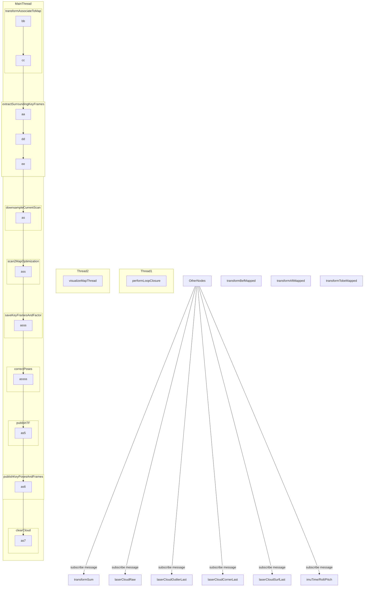

```mermaid
graph TB
    subgraph Thread1
        performLoopClosure
    end

    subgraph Thread2
        visualizeMapThread
    end

    subgraph MainThread
        direction TB
        subgraph transformAssociateToMap
            direction TB
            bb
            cc

        end
        subgraph extractSurroundingKeyFrames
            direction TB
            aa --> dd --> ee 
        end
        subgraph downsampleCurrentScan
            direction TB
        as
        end
        subgraph scan2MapOptimization
            direction TB
        ass
        end
        subgraph saveKeyFramesAndFactor
            direction TB
        asss
        end
        subgraph correctPoses
            direction TB
        assss
        end
        subgraph publishTF
            direction TB
        as5
        end
        subgraph publishKeyPosesAndFrames
            direction TB
        as6
        end
        subgraph clearCloud
            direction TB
        as7
        end
        bb--->cc
        cc--->aa
        ee--->as
        as--->ass
        ass--->asss
        asss--->assss
        assss--->as5
        as5--->as6
        as6--->as7

        
    end
    OtherNodes --subscribe message--> transformSum
    OtherNodes --subscribe message--> laserCloudRaw
    OtherNodes --subscribe message--> laserCloudOutlierLast
    OtherNodes --subscribe message--> laserCloudCornerLast
    OtherNodes --subscribe message--> laserCloudSurfLast
    OtherNodes --subscribe message--> imuTime/Roll/Pitch
    transformBefMapped
    transformAftMapped
    transformTobeMapped
```
