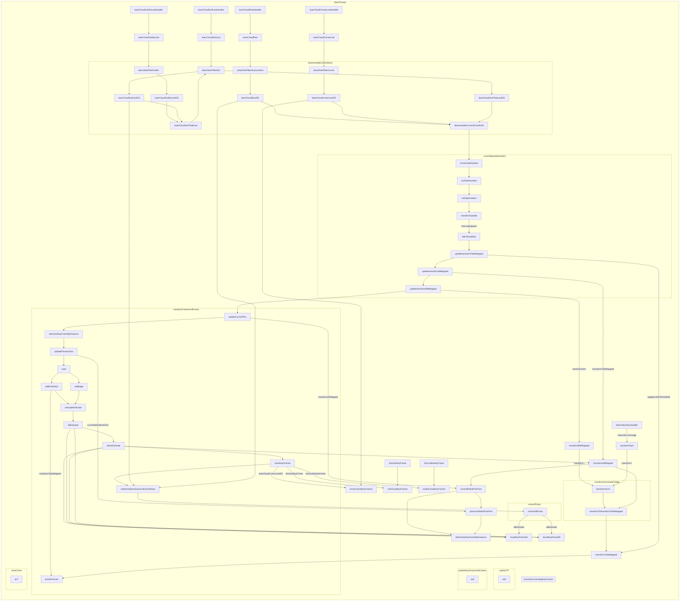
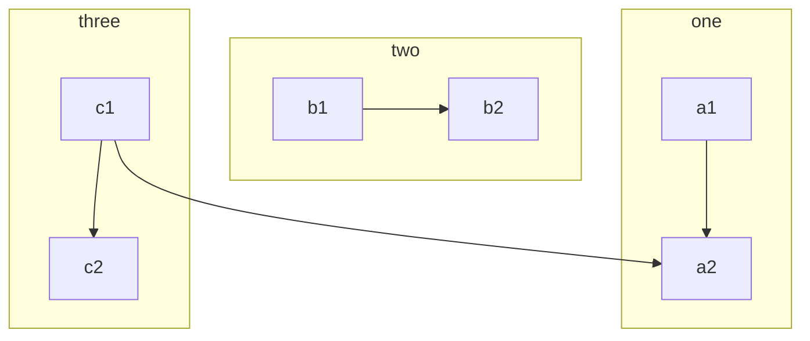
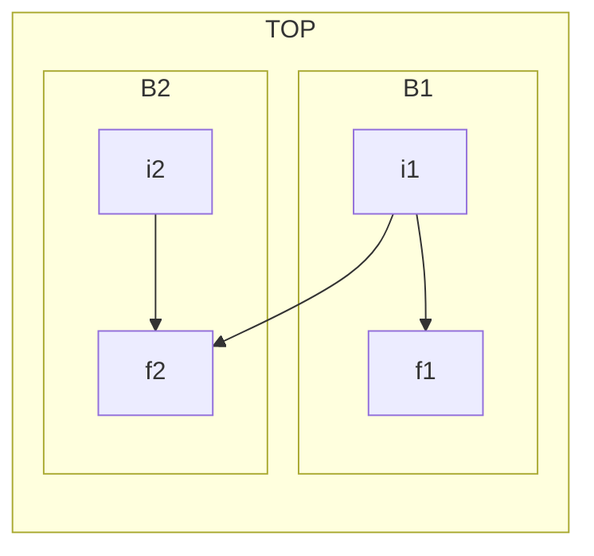
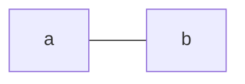
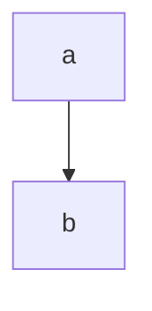
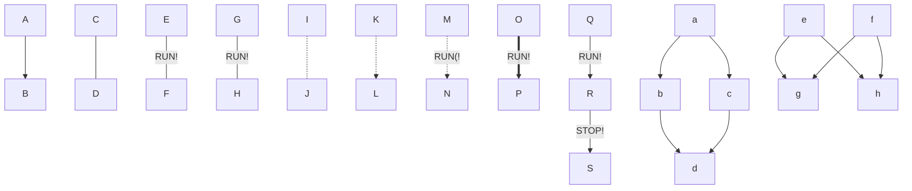
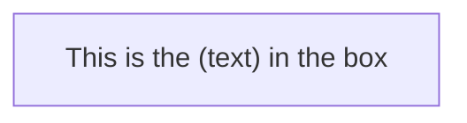

```mermaid
graph TB
    %%subgraph Thread1
    %%    performLoopClosure
    %% end


    %%subgraph Thread2
    %%    visualizeMapThread
    %%end

    subgraph MainThread
        direction TB
        subgraph transformAssociateToMap
            direction TB
            transformIncre --> transformTotransformTobeMapped
        end
        transformBefMapped --transform to-->transformIncre
        transformSum --transform to--> transformIncre
        transformAftMapped ---> transformTotransformTobeMapped
        transformTotransformTobeMapped ---> transformTobeMapped

        subgraph extractSurroundingKeyFrames
            direction TB
        end
        subgraph downsampleCurrentScan
            direction TB
            downSizeFilterScancontext ---> laserCloudRawDS ---> downsampleCurrentScanfinish
            downSizeFilterCorner ---> laserCloudCornerLastDS ---> downsampleCurrentScanfinish
            downSizeFilterSurf ---> laserCloudSurfLastDS
            downSizeFilterOutlier ---> laserCloudOutlierLastDS
            downSizeFilterSurf ---> laserCloudSurfTotalLastDS ---> downsampleCurrentScanfinish
            laserCloudOutlierLastDS ---> laserCloudSurfTotalLast 
            laserCloudSurfLastDS ---> laserCloudSurfTotalLast
            laserCloudSurfTotalLast ---> downSizeFilterSurf
        end
        laserCloudRawHandler ---> laserCloudRaw ---> downSizeFilterScancontext
        laserCloudCornerLastHandler ---> laserCloudCornerLast ---> downSizeFilterCorner
        laserCloudOutlierLastHandler ---> laserCloudOutlierLast ---> downSizeFilterOutlier
        laserCloudSurfLastHandler ---> laserCloudSurfLast ---> downSizeFilterSurf

        subgraph scan2MapOptimization
            direction TB
            cornerOptimization --> surfOptimization --> LMOptimization --> transformUpdate
            transformUpdate -- time interplation --> IMUPitch&Roll --> updatetransformTobeMapped --> updatetransformAftMapped --> updatetransformBefMapped
        end
        downsampleCurrentScanfinish ---> cornerOptimization
        updatetransformTobeMapped --weighed IMUPitch&Roll--> transformTobeMapped
        updatetransformAftMapped --transformTobeMapped-->transformAftMapped
        updatetransformBefMapped --transformSum--> transformBefMapped

        subgraph saveKeyFramesAndFactor
            direction TB
            updateCurrentPos --> etermineKeyFrameByDistance --> updatePreviousPos --> isam
            isam --> addFirstPoint --> calculateEstimate
            isam --> addEdge --> calculateEstimate
            addFirstPoint --transformTobeMapped--> transformLast
            calculateEstimate --> allEstimate --> latestEstimate --> storeKeyFrames --> makeAndSaveScancontextAndKeys
        end
        transformTobeMapped --> transformLast
        transformAftMapped --> currentRobotPosPoint
        currentRobotPosPoint --> DetermineKeyFrameByDistance
        previousRobotPosPoint --> DetermineKeyFrameByDistance
        updatePreviousPos --currentRobotPosPoint--> previousRobotPosPoint
        updatetransformBefMapped --> updateCurrentPos
        updateCurrentPos --transformAftMapped--> currentRobotPosPoint
        currentRobotPosPoint --> previousRobotPosPoint
        latestEstimate --> cloudKeyPoses3D
        latestEstimate --> cloudKeyPoses6D
        latestEstimate --> transformAftMapped
        storeKeyFrames --laserCloudCornerLastDS--> cornerCloudKeyFrames
        laserCloudCornerLastDS --> cornerCloudKeyFrames
        storeKeyFrames --thisSurfKeyFrame--> surfCloudKeyFrames
        thisSurfKeyFrame--> surfCloudKeyFrames
        storeKeyFrames --thisOutlierKeyFrame--> outlierCloudKeyFrames
        thisOutlierKeyFrame--> outlierCloudKeyFrames
        laserCloudSurfLastDS --> makeAndSaveScancontextAndKeys
        laserCloudRawDS --> makeAndSaveScancontextAndKeys

        subgraph correctPoses
            direction TB
            correctAllPoses
        end
        correctAllPoses --allEstimate--> cloudKeyPoses3D
        allEstimate--> cloudKeyPoses3D
        correctAllPoses --allEstimate--> cloudKeyPoses6D
        allEstimate--> cloudKeyPoses6D
        makeAndSaveScancontextAndKeys --> correctAllPoses

        subgraph publishTF
            direction TB
        as5
        end
        subgraph publishKeyPosesAndFrames
            direction TB
        as6
        end
        subgraph clearCloud
            direction TB
        as7
        end

        laserOdometryHandler --subscribe message--> transformSum           
    end

    %%OtherNodes --subscribe message--> laserCloudRaw
    %%OtherNodes --subscribe message--> laserCloudOutlierLast
    %%OtherNodes --subscribe message--> laserCloudCornerLast
    %%OtherNodes --subscribe message--> laserCloudSurfLast
    %%OtherNodes --subscribe message--> imuTime/Roll/Pitch
    
    transformAftMapped
    transformTobeMapped
```

```mermaid
graph TD
    c1 --> a2
    subgraph one
    a1-->a2
    end
    subgraph two
    b1-->b2
    end
    subgraph three
    c1-->c2
    end
```

```mermaid
graph LR

  subgraph TOP
    direction TB
    subgraph B1
        direction RL
        i1 -->f1
    end
    subgraph B2
        direction BT
        i2 -->f2
    end
  end

    i1 --> f2
```

```mermaid
graph LR
a --- b
```

```mermaid
graph TD
a-->b
```

```mermaid
graph TD
a --> b
```

```mermaid
graph TD

A-->B
C---D
E--RUN!---F
G---|RUN!|H
I -.- J
K .-> L
M -."RUN(!".->N
O ==RUN!==>P
Q --RUN!-->R--STOP!-->S

a --> b & c--> d
e & f--> g & h
```

```mermaid
graph  LR
        id1["This is the (text) in the box"]
```
