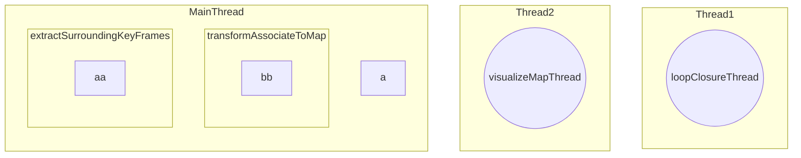

```mermaid
graph TD
    %%transformAssociateToMap((transformAssociateToMap))
    %%extractSurroundingKeyFrames((extractSurroundingKeyFrames))
    %%downsampleCurrentScan((downsampleCurrentScan))
    %%scan2MapOptimization((scan2MapOptimization))
    %%saveKeyFramesAndFactor((saveKeyFramesAndFactor))
    %%correctPoses((correctPoses))
    %%publishTF((publishTF))
    %%publishKeyPosesAndFrames((publishKeyPosesAndFrames))
    %%clearCloud((clearCloud))
    loopClosureThread((loopClosureThread))
    visualizeMapThread((visualizeMapThread))

    subgraph Thread1
        loopClosureThread
    end

    subgraph Thread2
        visualizeMapThread
    end

    subgraph MainThread
        direction TD
        
        
        a
        subgraph transformAssociateToMap
            bb
        end
        subgraph extractSurroundingKeyFrames
           aa
        end
        %%transformAssociateToMap --> extractSurroundingKeyFrames
        %%extractSurroundingKeyFrames --> downsampleCurrentScan
        %%downsampleCurrentScan --> scan2MapOptimization
        %%scan2MapOptimization --> saveKeyFramesAndFactor
        %%saveKeyFramesAndFactor --> correctPoses
        %%correctPoses --> publishTF
        %%publishTF --> publishKeyPosesAndFrames
        %%publishKeyPosesAndFrames --> clearCloud
    end
```
