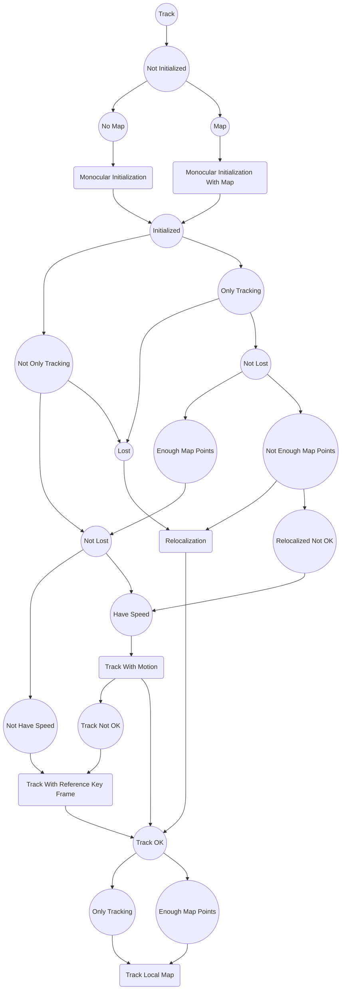
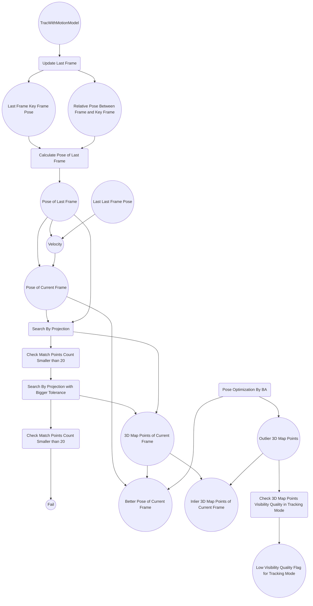
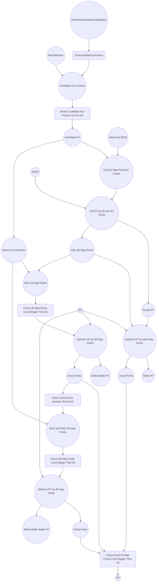
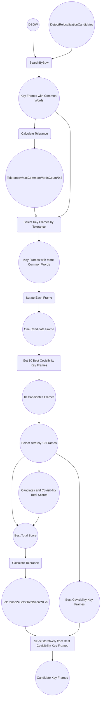
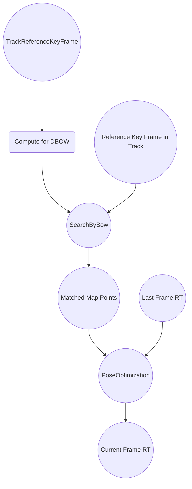
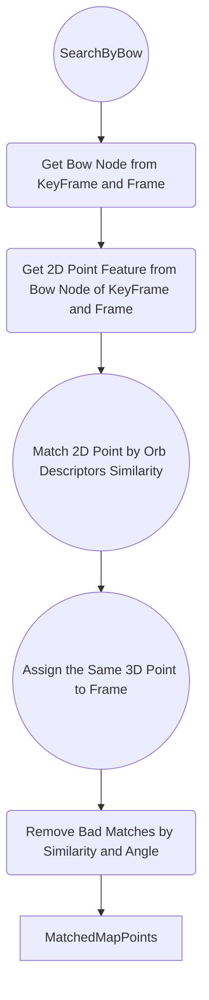
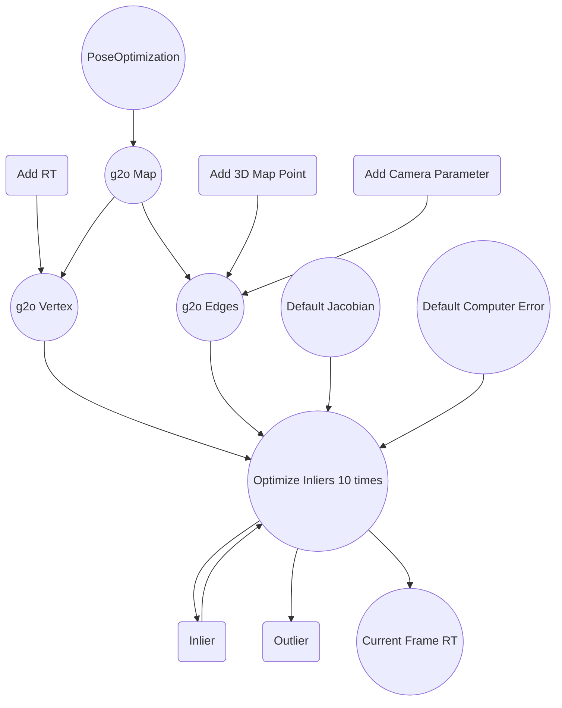
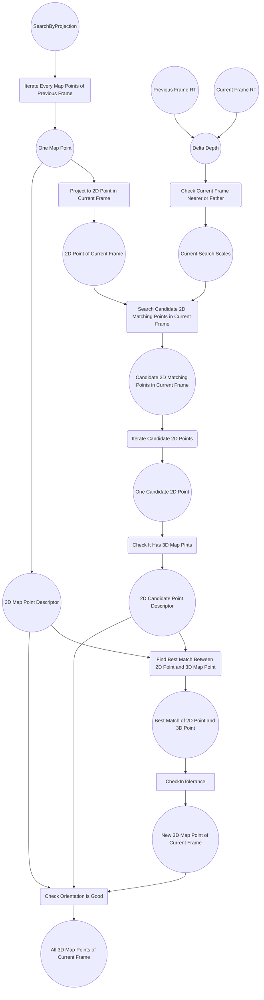
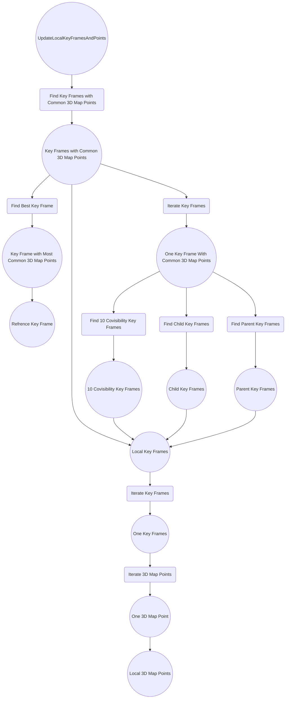
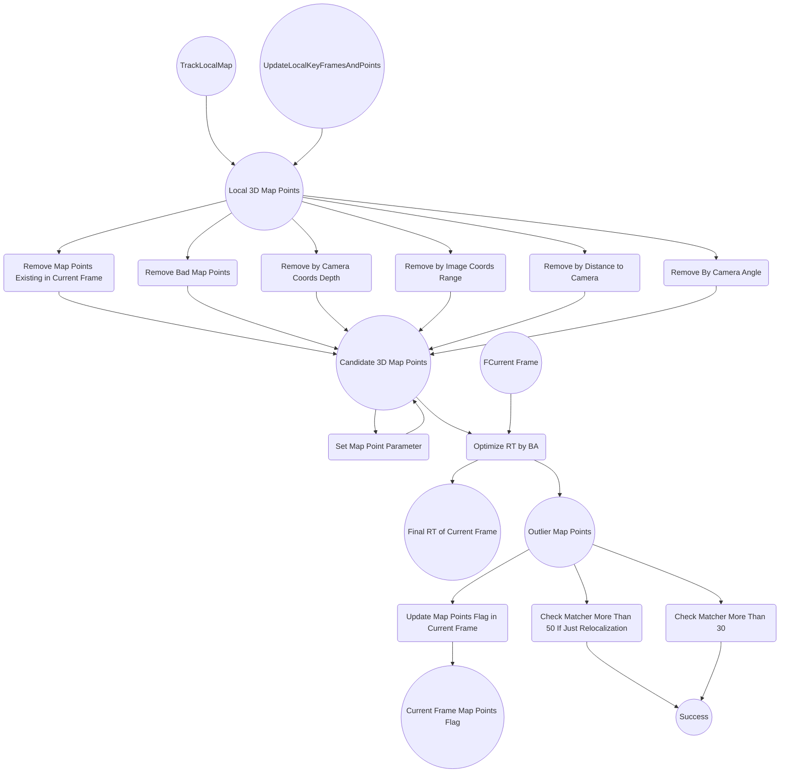

```mermaid
			graph TD

			Track((Track)) --> NotInit
			MonoInit --> Init
			MonoInitWithMap --> Init
			NotInit((Not Initialized)) --> NoMap((No Map))
			NoMap --> MonoInit(Monocular Initialization)
			NotInit --> Map
			Map((Map)) --> MonoInitWithMap(Monocular Initialization With Map)
			Init --> NotOnlyTrack((Not Only Tracking))
			Init((Initialized)) --> OnlyTrack
			OnlyTrack((Only Tracking)) --> Lost
			OnlyTrack --> NotLostOT((Not Lost))
			Lost((Lost)) --> Relo(Relocalization)
			NotOnlyTrack --> NotLost((Not Lost))
			NotOnlyTrack --> Lost
			NotLost --> NotHaveSpeed((Not Have Speed))
			NotLost --> HaveSpeed((Have Speed))
			HaveSpeed --> TrackWithMotion(Track With Motion)
			
			NotLostOT --> EnoughMapPoint((Enough Map Points))
			EnoughMapPoint --> NotLost
			NotLostOT --> NotEnoughMapPoint((Not Enough Map Points))
			NotEnoughMapPoint --> Relo	
			NotEnoughMapPoint --> ReloNotOK((Relocalized Not OK))
			ReloNotOK --> HaveSpeed		
			
			
			TrackWithMotion --> NotOK((Track Not OK))
			TrackWithMotion --> OK((Track OK))
			NotOK --> TrackWithReferenceKeyFrame(Track With Reference Key Frame)
			NotHaveSpeed --> TrackWithReferenceKeyFrame
			TrackWithReferenceKeyFrame --> OK
			Relo --> OK
			

			OK --> OTrack((Only Tracking))
			OTrack --> TrackLocalMap(Track Local Map)
			OK --> EMapPoint((Enough Map Points))
			EMapPoint --> TrackLocalMap
```

```mermaid 
		graph TD
			TrackWithMotionModel((TracWithMotionModel)) --> UpdateLastFrame
			CalLastFramePose(Calculate Pose of Last Frame) --> LastFramePose((Pose of Last Frame))
			LastFrameKPPose((Last Frame Key Frame Pose)) --> CalLastFramePose
			RelativeFramePose((Relative Pose Between Frame and Key Frame)) --> CalLastFramePose			
			UpdateLastFrame(Update Last Frame) --> LastFrameKPPose
			UpdateLastFrame --> RelativeFramePose
			
			
			CurrentFramePose((Pose of Current Frame)) --> SearchByProjection
			LastFramePose --> SearchByProjection
			LastFramePose --> CurrentFramePose
			LastFramePose --> Velocity
			LastLastFramePose((Last Last Frame Pose)) --> Velocity
			Velocity((Velocity)) --> CurrentFramePose	
					
			SearchByProjection2 --> 3DMapPoints
			SearchByProjection(Search By Projection) --> 3DMapPoints((3D Map Points of Current Frame))
			SearchByProjection --> Check(Check Match Points Count Smaller than 20)
			Check --> SearchByProjection2(Search By Projection with Bigger Tolerance)
			SearchByProjection2 --> Check2
			Check2(Check Match Points Count Smaller than 20) --> Fail((Fail))
						CurrentFramePose --> BetterCurrentFramePose((Better Pose of Current Frame))
			3DMapPoints --> BetterCurrentFramePose
			PoseOptimization(Pose Optimization By BA) --> BetterCurrentFramePose
			PoseOptimization --> Outlier((Outlier 3D Map Points)) 
			
			3DMapPoints --> Valid3DMapPoints((Inlier 3D Map Points of Current Frame))
			Outlier --> Valid3DMapPoints
			Outlier --> Check3(Check 3D Map Points Visibility Quality in Tracking Mode)
			Check3 --> VisibilityFlag((Low Visibility Quality Flag for Tracking Mode))
```

```mermaid
		graph TD
			
			Relocalization((Relocalization)) --> CandidateKeyFrames((Candidate Key Frames))
			DetectRelocalizationCandidates((DetectRelocalizationCandidates)) --> FindCandidateKeyFrames
			FindCandidateKeyFrames(FindcandidateKeyFrames) --> CandidateKeyFrames
			CandidateKeyFrames --> IterateCandidates(Iterate Candidate Key Frames one by one)
			IterateCandidates --> Candidate((Candidate KF))
			SearchByBow((Search by BOW)) --> 3DMapPoints
			Candidate --> 3DMapPoints((Find 3D Map Points for Frame))
			
			3DMapPoints --> GetRT((Get RT by 3D and 2D Points))
			GetRT --> RoughRT((Rough RT))
			EPNP((EPNP)) --> GetRT
			GetRT --> Inliers 
			Inliers((Inlier 3D Map Points))
			RoughRT --> BA
			Inliers --> BA
			BA((Optimize RT by Inlier Map Points)) --> BetterRT((Better RT))
			BA --> Good((Good Points))
			Check(Check Good 3D Map Points Count Bigger Than 50) --> OK((OK))
			Good --> Check
			Candidate --> SearchByProjection
			SearchByProjection((Search by Projection)) --> More3DPoints((More 3D Map Points))
			Check2(Check 3D Map Points Count Bigger Than 50) --> BA2((Optimize RT by 3D Map Points))
			BA2 --> BetterBetterRT((Better Better RT))
			PoseOptimization((BA)) --> BA
			PoseOptimization((BA)) --> BA2
			More3DPoints --> Check2
			Inliers --> More3DPoints
			BA2 --> Good2((Good Points))
			Good2 --> Check
			Good2 --> Check3(Check Good Points between 30 and 50)
			Check3 --> MoreMore3DPoints((More and More 3D Map Points))
			SearchByProjection --> MoreMore3DPoints
			MoreMore3DPoints --> Check4(Check 3D Map Points Count Bigger Than 50)
			Check4 --> BA3((Optimize RT by 3D Map Points))
			PoseOptimization --> BA3
			BA3 --> Good3((Good Points))
			Good3 --> Check
			BA3 --> BetterBetterBetterRT((Better Better Better RT))
			
```

```mermaid
		graph TD
			DetectRelocalizationCandidates((DetectRelocalizationCandidates))
			DBOW((DBOW)) --> SearchByDBOW
			DetectRelocalizationCandidates --> SearchByDBOW(SearchByBow)
			SearchByDBOW --> KeyFramesWithSameWord((Key Frames with Common Words))
			KeyFramesWithSameWord --> CalculateTolerance(Calculate Tolerance)
			CalculateTolerance --> Tolerance((Tolerance=MaxCommonWordsCount*0.8))
			Tolerance --> SelectKeyFrames(Select Key Frames by Tolerance)
			KeyFramesWithSameWord --> SelectKeyFrames
			SelectKeyFrames --> KeyFrames1((Key Frames with More Common Words))
			KeyFrames1 --> Iterate(Iterate Each Frame)
			Iterate --> OneCandidateFrame((One Candidate Frame))
			OneCandidateFrame --> GetBestCovisibility(Get 10 Best Covisibility Key Frames)
			GetBestCovisibility --> 10Frames((10 Candidates Frames))
			10Frames --> Select1((Select iterately 10 Frames))
			Select1 --> BestFrame((Best Covisibility Key Frames))
			Select1 --> Score((Candiates and Covisibility Total Scores))
			Select1 --> BestScore((Best Total Score))
			Score --> BestScore
			BestScore --> CalTolerance2(Calculate Tolerance)
			CalTolerance2 --> Tolerance2((Tolerance2=BetstTotalScore*0.75))
			Tolerance2 --> Select2
			BestFrame --> Select2
			Select2(Select iteratively from Best Covisibility Key Frames) --> CandidateKeyFrames
			CandidateKeyFrames((Candidate Key Frames))
```

```mermaid
      graph TD
			TrackReferenceKeyFrame((TrackReferenceKeyFrame)) --> ComputeBow(Compute for DBOW)
			ComputeBow --> SearchByBow	
			SearchByBow((SearchByBow)) --> MatchedMapPoints
			RefKeyFrame((Reference Key Frame in Track)) --> SearchByBow
			MatchedMapPoints((Matched Map Points)) --> PoseOptimization((PoseOptimization))
			LastRT((Last Frame RT)) --> PoseOptimization
			PoseOptimization --> CurrentRT((Current Frame RT))
			
			
```

```mermaid
 	graph TD
			SearchByBow((SearchByBow)) --> GetBowNode(Get Bow Node from KeyFrame and Frame)
			GetBowNode --> Get2DPointFeature(Get 2D Point Feature from Bow Node of KeyFrame and Frame)
			Get2DPointFeature --> Match2DPoint((Match 2D Point by Orb Descriptors Similarity))
			Match2DPoint --> Assign3DPoint((Assign the Same 3D Point to Frame))
			Assign3DPoint --> RemoveBadPoints(Remove Bad Matches by Similarity and Angle)	
			RemoveBadPoints --> MatchedMapPoints
```

```mermaid
      graph TD
			PoseOptimization((PoseOptimization)) --> Start((g2o Map))
			AddVertex(Add RT) --> Vertex
			Start --> Edge((g2o Edges))
			Start --> Vertex((g2o Vertex))
			AddEdge(Add 3D Map Point) --> Edge
			AddCamera(Add Camera Parameter) --> Edge
			Inlier(Inlier)
			Outlier(Outlier)
			Optimize((Optimize Inliers 10 times))
			Vertex --> Optimize
			Edge --> Optimize
			Optimize --> Inlier
			Inlier --> Optimize
			Optimize --> Outlier
			LinearizeOplux((Default Jacobian)) --> Optimize
			ComputerError((Default Computer Error)) --> Optimize
			Optimize --> CurrentRT((Current Frame RT))
```

```mermaid
			graph TD
				SearchByProjection((SearchByProjection)) --> IterateMP(Iterate Every Map Points of Previous Frame)
				IterateMP --> OneMP((One Map Point))
				OneMP --> Project2DPoint(Project to 2D Point in Current Frame)
				Project2DPoint --> 2DPoint((2D Point of Current Frame)) 
				
				CheckNearFar(Check Current Frame Nearer or Father)
				PreviousRT((Previous Frame RT)) --> DeltaDepth((Delta Depth))
				CurrentRT((Current Frame RT)) --> DeltaDepth((Delta Depth))
				DeltaDepth --> CheckNearFar
				CheckNearFar --> CurrentSearchScale((Current Search Scales))
				
				2DPoint --> SearchCandidate2DPoint(Search Candidate 2D Matching Points in Current Frame)
				CurrentSearchScale --> SearchCandidate2DPoint
				SearchCandidate2DPoint --> Candidate2DPoints((Candidate 2D Matching Points in Current Frame))
				Candidate2DPoints --> IterateCandidates(Iterate Candidate 2D Points)
				IterateCandidates --> OneCandidateP((One Candidate 2D Point))
				OneCandidateP --> CheckHave3DMP(Check It Has 3D Map Pints)
				CheckHave3DMP --> 2DPDesp((2D Candidate Point Descriptor))
				OneMP --> 3DMPDesp((3D Map Point Descriptor))
				2DPDesp --> FindBestSimliliarMatch(Find Best Match Between 2D Point and 3D Map Point)
				3DMPDesp --> FindBestSimliliarMatch
				FindBestSimliliarMatch --> BestMatch((Best Match of 2D Point and 3D Point))	
				BestMatch --> CheckInTolerance
				CheckInTolerance --> New3DMP((New 3D Map Point of Current Frame))	
				New3DMP --> CheckOrientation(Check Orientation is Good)	
				2DPDesp --> CheckOrientation
				3DMPDesp --> CheckOrientation
				CheckOrientation --> All3DMP((All 3D Map Points of Current Frame))
```

```mermaid 
		graph TD
			UpdateLocalKeyFrames((UpdateLocalKeyFramesAndPoints)) --> FindCovisibilityKeyFrame(Find Key Frames with Common 3D Map Points)
			FindCovisibilityKeyFrame --> KeyFramesWithCommonMP((Key Frames with Common 3D Map Points))
			KeyFramesWithCommonMP --> FindMaxKF(Find Best Key Frame)
			FindMaxKF --> MaxKF((Key Frame with Most Common 3D Map Points))
			MaxKF --> RefrenceKF((Refrence Key Frame))

			KeyFramesWithCommonMP --> IterateKeyFrames(Iterate Key Frames)
			IterateKeyFrames --> OneKFWithCommonMP((One Key Frame With Common 3D Map Points))
			OneKFWithCommonMP --> FindCovisibilityKF(Find 10 Covisibility Key Frames)
			FindCovisibilityKF --> 10CovisibilityKF((10 Covisibility Key Frames))
			OneKFWithCommonMP --> FindChildKF(Find Child Key Frames)
			FindChildKF --> ChildKF((Child Key Frames))
			OneKFWithCommonMP --> FindParentKF(Find Parent Key Frames)
			FindParentKF --> ParentKF((Parent Key Frames))
			
			KeyFramesWithCommonMP --> LocalKF((Local Key Frames))
			10CovisibilityKF --> LocalKF
			ChildKF --> LocalKF
			ParentKF --> LocalKF
			
			
			LocalKF((Local Key Frames)) --> IterateKF(Iterate Key Frames)
			IterateKF --> OneKF((One Key Frames))
			OneKF --> IterateMP(Iterate 3D Map Points)
			IterateMP --> OneMP((One 3D Map Point))
			OneMP --> LocalMapPoints((Local 3D Map Points))
```

```mermaid 
		graph TD
			TrackLocalMap((TrackLocalMap)) --> LocalMapPoints
			UpdateLocalKeyFrames((UpdateLocalKeyFramesAndPoints)) --> LocalMapPoints
			LocalMapPoints((Local 3D Map Points)) --> RemoveExistingMP(Remove Map Points Existing in Current Frame)
			LocalMapPoints --> RemoveBadMP(Remove Bad Map Points)
			RemoveExistingMP --> CandidateMP((Candidate 3D Map Points))		
			RemoveBadMP --> CandidateMP	
			LocalMapPoints --> RemoveByDepth(Remove by Camera Coords Depth)
			RemoveByDepth --> CandidateMP
			LocalMapPoints --> RemoveByImageRange(Remove by Image Coords Range)
			RemoveByImageRange --> CandidateMP
			LocalMapPoints --> RemoveByDistanceToCamera(Remove by Distance to Camera)
			RemoveByDistanceToCamera --> CandidateMP
			LocalMapPoints --> RemoveByCameraAngle(Remove By Camera Angle)
			RemoveByCameraAngle --> CandidateMP
			CandidateMP --> SetParameter(Set Map Point Parameter)
			SetParameter --> CandidateMP
			CandidateMP --> PoseOptimization(Optimize RT by BA)
			CurrentFrame((FCurrent Frame)) --> PoseOptimization
			PoseOptimization --> FinalRT((Final RT of Current Frame))
			PoseOptimization --> Outlier((Outlier Map Points))
			Outlier --> SetMPFlag(Update Map Points Flag in Current Frame)
			SetMPFlag --> MPFlag((Current Frame Map Points Flag))
			Outlier --> CheckMatcher1(Check Matcher More Than 50 If Just Relocalization)
			Outlier --> CheckMatcher2(Check Matcher More Than 30)
			CheckMatcher1 --> Success((Success))
			CheckMatcher2 --> Success
```
