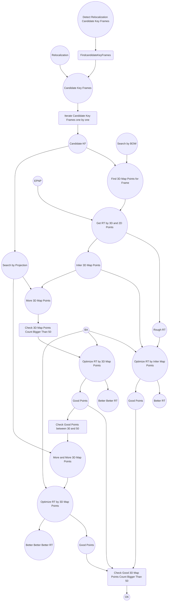
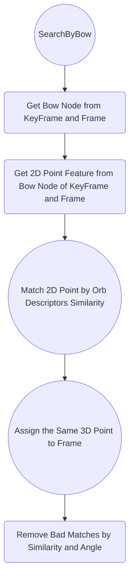
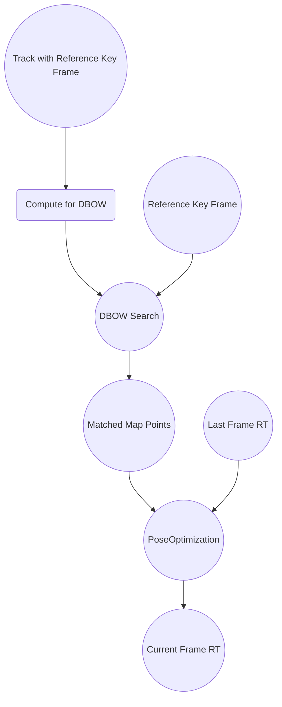
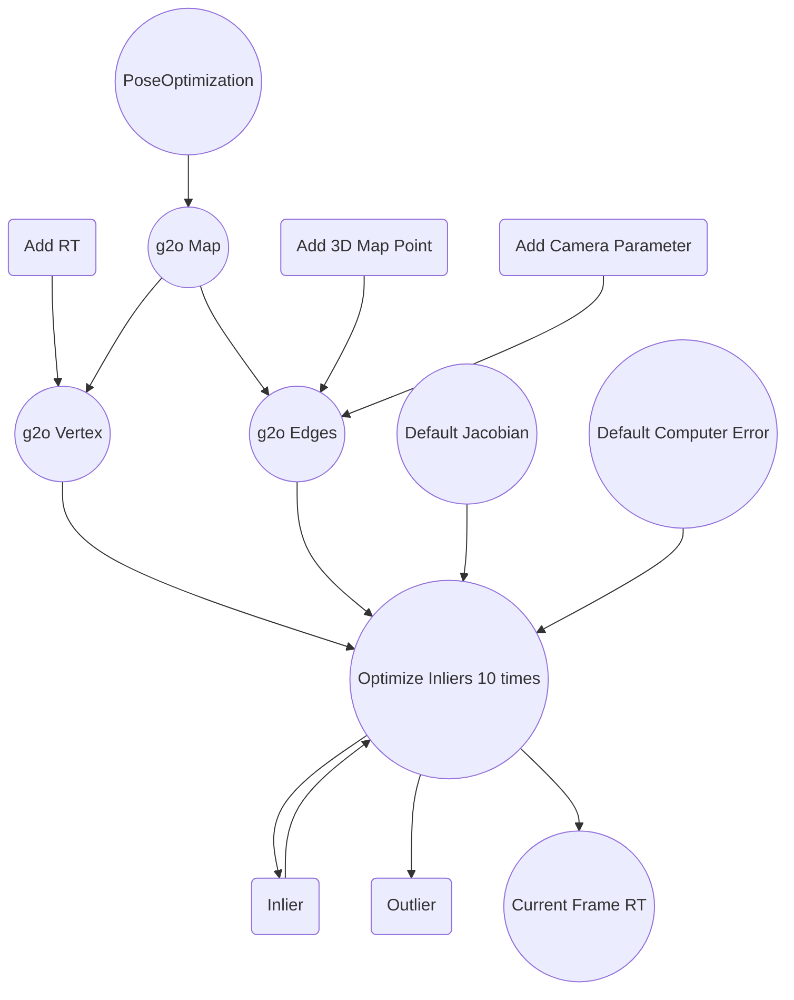

```mermaid
		graph TD
			Relocalization((Relocalization)) --> CandidateKeyFrames((Candidate Key Frames))
			DetectRelocalizationCandidates((Detect Relocalization Candidate Key Frames)) --> FindCandidateKeyFrames
			FindCandidateKeyFrames(FindcandidateKeyFrames) --> CandidateKeyFrames
			CandidateKeyFrames --> IterateCandidates(Iterate Candidate Key Frames one by one)
			IterateCandidates --> Candidate((Candidate KF))
			SearchByBow((Search by BOW)) --> 3DMapPoints
			Candidate --> 3DMapPoints((Find 3D Map Points for Frame))
			
			3DMapPoints --> GetRT((Get RT by 3D and 2D Points))
			GetRT --> RoughRT((Rough RT))
			EPNP((EPNP)) --> GetRT
			GetRT --> Inliers 
			Inliers((Inlier 3D Map Points))
			RoughRT --> BA
			Inliers --> BA
			BA((Optimize RT by Inlier Map Points)) --> BetterRT((Better RT))
			BA --> Good((Good Points))
			Check(Check Good 3D Map Points Count Bigger Than 50) --> OK((OK))
			Good --> Check
			Candidate --> SearchByProjection
			SearchByProjection((Search by Projection)) --> More3DPoints((More 3D Map Points))
			Check2(Check 3D Map Points Count Bigger Than 50) --> BA2((Optimize RT by 3D Map Points))
			BA2 --> BetterBetterRT((Better Better RT))
			PoseOptimization((BA)) --> BA
			PoseOptimization((BA)) --> BA2
			More3DPoints --> Check2
			Inliers --> More3DPoints
			BA2 --> Good2((Good Points))
			Good2 --> Check
			Good2 --> Check3(Check Good Points between 30 and 50)
			Check3 --> MoreMore3DPoints((More and More 3D Map Points))
			SearchByProjection --> MoreMore3DPoints
			MoreMore3DPoints --> BA3((Optimize RT by 3D Map Points))
			PoseOptimization --> BA3
			BA3 --> Good3((Good Points))
			Good3 --> Check
			BA3 --> BetterBetterBetterRT((Better Better Better RT))
			
```

```mermaid
      graph TD
			SearchByBow((SearchByBow)) --> GetBowNode(Get Bow Node from KeyFrame and Frame)
			GetBowNode --> Get2DPointFeature(Get 2D Point Feature from Bow Node of KeyFrame and Frame)
			Get2DPointFeature --> Match2DPoint((Match 2D Point by Orb Descriptors Similarity))
			Match2DPoint --> Assign3DPoint((Assign the Same 3D Point to Frame))
			Assign3DPoint --> RemoveBadPoints(Remove Bad Matches by Similarity and Angle)			
```

```mermaid
      graph TD
			TrackReferenceKeyFrame((Track with Reference Key Frame)) --> ComputeBow(Compute for DBOW)
			ComputeBow --> DBOW
			DBOW((DBOW Search)) --> MatchedMapPoints((Matched Map Points))
			RefKeyFrame((Reference Key Frame)) --> DBOW
			MatchedMapPoints --> PoseOptimization((PoseOptimization))
			LastRT((Last Frame RT)) --> PoseOptimization
			PoseOptimization --> CurrentRT((Current Frame RT))
```

```mermaid
      graph TD
			PoseOptimization((PoseOptimization)) --> Start((g2o Map))
			AddVertex(Add RT) --> Vertex
			Start --> Edge((g2o Edges))
			Start --> Vertex((g2o Vertex))
			AddEdge(Add 3D Map Point) --> Edge
			AddCamera(Add Camera Parameter) --> Edge
			Inlier(Inlier)
			Outlier(Outlier)
			Optimize((Optimize Inliers 10 times))
			Vertex --> Optimize
			Edge --> Optimize
			Optimize --> Inlier
			Inlier --> Optimize
			Optimize --> Outlier
			LinearizeOplux((Default Jacobian)) --> Optimize
			ComputerError((Default Computer Error)) --> Optimize
			Optimize --> CurrentRT((Current Frame RT))
```
