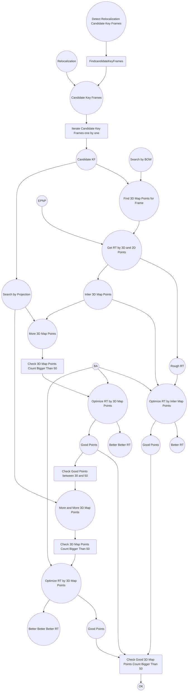
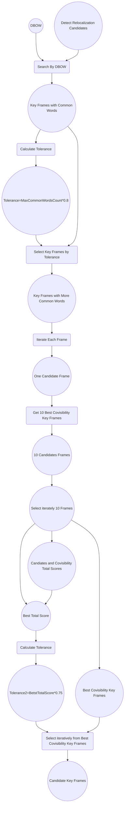
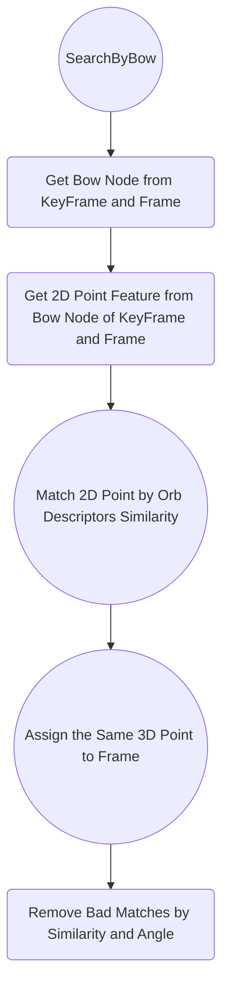
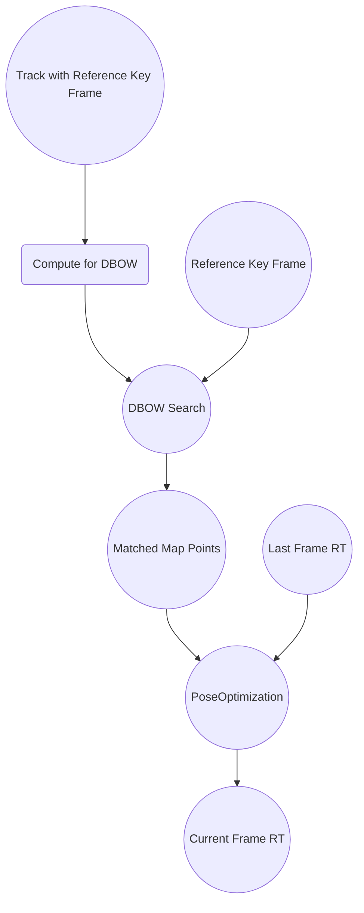
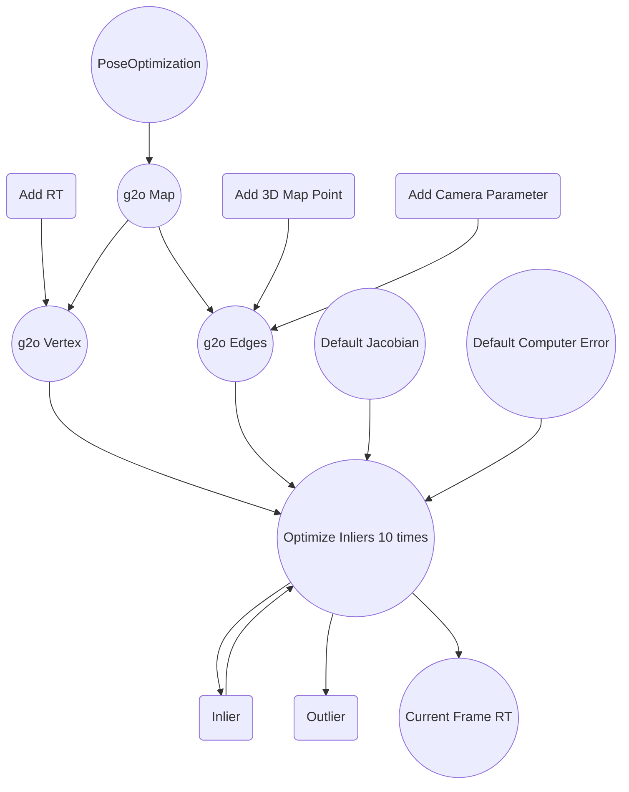
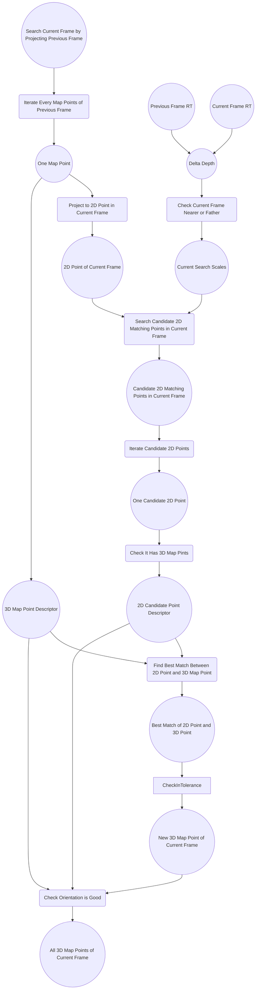

```mermaid
		graph TD
			Relocalization((Relocalization)) --> CandidateKeyFrames((Candidate Key Frames))
			DetectRelocalizationCandidates((Detect Relocalization Candidate Key Frames)) --> FindCandidateKeyFrames
			FindCandidateKeyFrames(FindcandidateKeyFrames) --> CandidateKeyFrames
			CandidateKeyFrames --> IterateCandidates(Iterate Candidate Key Frames one by one)
			IterateCandidates --> Candidate((Candidate KF))
			SearchByBow((Search by BOW)) --> 3DMapPoints
			Candidate --> 3DMapPoints((Find 3D Map Points for Frame))
			
			3DMapPoints --> GetRT((Get RT by 3D and 2D Points))
			GetRT --> RoughRT((Rough RT))
			EPNP((EPNP)) --> GetRT
			GetRT --> Inliers 
			Inliers((Inlier 3D Map Points))
			RoughRT --> BA
			Inliers --> BA
			BA((Optimize RT by Inlier Map Points)) --> BetterRT((Better RT))
			BA --> Good((Good Points))
			Check(Check Good 3D Map Points Count Bigger Than 50) --> OK((OK))
			Good --> Check
			Candidate --> SearchByProjection
			SearchByProjection((Search by Projection)) --> More3DPoints((More 3D Map Points))
			Check2(Check 3D Map Points Count Bigger Than 50) --> BA2((Optimize RT by 3D Map Points))
			BA2 --> BetterBetterRT((Better Better RT))
			PoseOptimization((BA)) --> BA
			PoseOptimization((BA)) --> BA2
			More3DPoints --> Check2
			Inliers --> More3DPoints
			BA2 --> Good2((Good Points))
			Good2 --> Check
			Good2 --> Check3(Check Good Points between 30 and 50)
			Check3 --> MoreMore3DPoints((More and More 3D Map Points))
			SearchByProjection --> MoreMore3DPoints
			MoreMore3DPoints --> Check4(Check 3D Map Points Count Bigger Than 50)
			Check4 --> BA3((Optimize RT by 3D Map Points))
			PoseOptimization --> BA3
			BA3 --> Good3((Good Points))
			Good3 --> Check
			BA3 --> BetterBetterBetterRT((Better Better Better RT))
			
```

```mermaid
		graph TD
			DetectRelocalizationCandidates((Detect Relocalization Candidates))
			DBOW((DBOW)) --> SearchByDBOW
			DetectRelocalizationCandidates --> SearchByDBOW(Search By DBOW)
			SearchByDBOW --> KeyFramesWithSameWord((Key Frames with Common Words))
			KeyFramesWithSameWord --> CalculateTolerance(Calculate Tolerance)
			CalculateTolerance --> Tolerance((Tolerance=MaxCommonWordsCount*0.8))
			Tolerance --> SelectKeyFrames(Select Key Frames by Tolerance)
			KeyFramesWithSameWord --> SelectKeyFrames
			SelectKeyFrames --> KeyFrames1((Key Frames with More Common Words))
			KeyFrames1 --> Iterate(Iterate Each Frame)
			Iterate --> OneCandidateFrame((One Candidate Frame))
			OneCandidateFrame --> GetBestCovisibility(Get 10 Best Covisibility Key Frames)
			GetBestCovisibility --> 10Frames((10 Candidates Frames))
			10Frames --> Select1((Select iterately 10 Frames))
			Select1 --> BestFrame((Best Covisibility Key Frames))
			Select1 --> Score((Candiates and Covisibility Total Scores))
			Select1 --> BestScore((Best Total Score))
			Score --> BestScore
			BestScore --> CalTolerance2(Calculate Tolerance)
			CalTolerance2 --> Tolerance2((Tolerance2=BetstTotalScore*0.75))
			Tolerance2 --> Select2
			BestFrame --> Select2
			Select2(Select iteratively from Best Covisibility Key Frames) --> CandidateKeyFrames
			CandidateKeyFrames((Candidate Key Frames))
```

```mermaid
      graph TD
			SearchByBow((SearchByBow)) --> GetBowNode(Get Bow Node from KeyFrame and Frame)
			GetBowNode --> Get2DPointFeature(Get 2D Point Feature from Bow Node of KeyFrame and Frame)
			Get2DPointFeature --> Match2DPoint((Match 2D Point by Orb Descriptors Similarity))
			Match2DPoint --> Assign3DPoint((Assign the Same 3D Point to Frame))
			Assign3DPoint --> RemoveBadPoints(Remove Bad Matches by Similarity and Angle)			
```

```mermaid
      graph TD
			TrackReferenceKeyFrame((Track with Reference Key Frame)) --> ComputeBow(Compute for DBOW)
			ComputeBow --> DBOW
			DBOW((DBOW Search)) --> MatchedMapPoints((Matched Map Points))
			RefKeyFrame((Reference Key Frame)) --> DBOW
			MatchedMapPoints --> PoseOptimization((PoseOptimization))
			LastRT((Last Frame RT)) --> PoseOptimization
			PoseOptimization --> CurrentRT((Current Frame RT))
```

```mermaid
      graph TD
			PoseOptimization((PoseOptimization)) --> Start((g2o Map))
			AddVertex(Add RT) --> Vertex
			Start --> Edge((g2o Edges))
			Start --> Vertex((g2o Vertex))
			AddEdge(Add 3D Map Point) --> Edge
			AddCamera(Add Camera Parameter) --> Edge
			Inlier(Inlier)
			Outlier(Outlier)
			Optimize((Optimize Inliers 10 times))
			Vertex --> Optimize
			Edge --> Optimize
			Optimize --> Inlier
			Inlier --> Optimize
			Optimize --> Outlier
			LinearizeOplux((Default Jacobian)) --> Optimize
			ComputerError((Default Computer Error)) --> Optimize
			Optimize --> CurrentRT((Current Frame RT))
```

```mermaid
			graph TD
				SearchByProjection((Search Current Frame by Projecting Previous Frame)) --> IterateMP(Iterate Every Map Points of Previous Frame)
				IterateMP --> OneMP((One Map Point))
				OneMP --> Project2DPoint(Project to 2D Point in Current Frame)
				Project2DPoint --> 2DPoint((2D Point of Current Frame)) 
				
				CheckNearFar(Check Current Frame Nearer or Father)
				PreviousRT((Previous Frame RT)) --> DeltaDepth((Delta Depth))
				CurrentRT((Current Frame RT)) --> DeltaDepth((Delta Depth))
				DeltaDepth --> CheckNearFar
				CheckNearFar --> CurrentSearchScale((Current Search Scales))
				
				2DPoint --> SearchCandidate2DPoint(Search Candidate 2D Matching Points in Current Frame)
				CurrentSearchScale --> SearchCandidate2DPoint
				SearchCandidate2DPoint --> Candidate2DPoints((Candidate 2D Matching Points in Current Frame))
				Candidate2DPoints --> IterateCandidates(Iterate Candidate 2D Points)
				IterateCandidates --> OneCandidateP((One Candidate 2D Point))
				OneCandidateP --> CheckHave3DMP(Check It Has 3D Map Pints)
				CheckHave3DMP --> 2DPDesp((2D Candidate Point Descriptor))
				OneMP --> 3DMPDesp((3D Map Point Descriptor))
				2DPDesp --> FindBestSimliliarMatch(Find Best Match Between 2D Point and 3D Map Point)
				3DMPDesp --> FindBestSimliliarMatch
				FindBestSimliliarMatch --> BestMatch((Best Match of 2D Point and 3D Point))	
				BestMatch --> CheckInTolerance
				CheckInTolerance --> New3DMP((New 3D Map Point of Current Frame))	
				New3DMP --> CheckOrientation(Check Orientation is Good)	
				2DPDesp --> CheckOrientation
				3DMPDesp --> CheckOrientation
				CheckOrientation --> All3DMP((All 3D Map Points of Current Frame))
```
