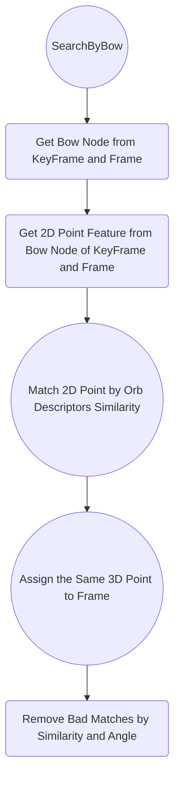
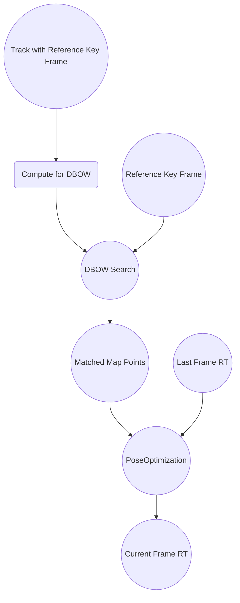
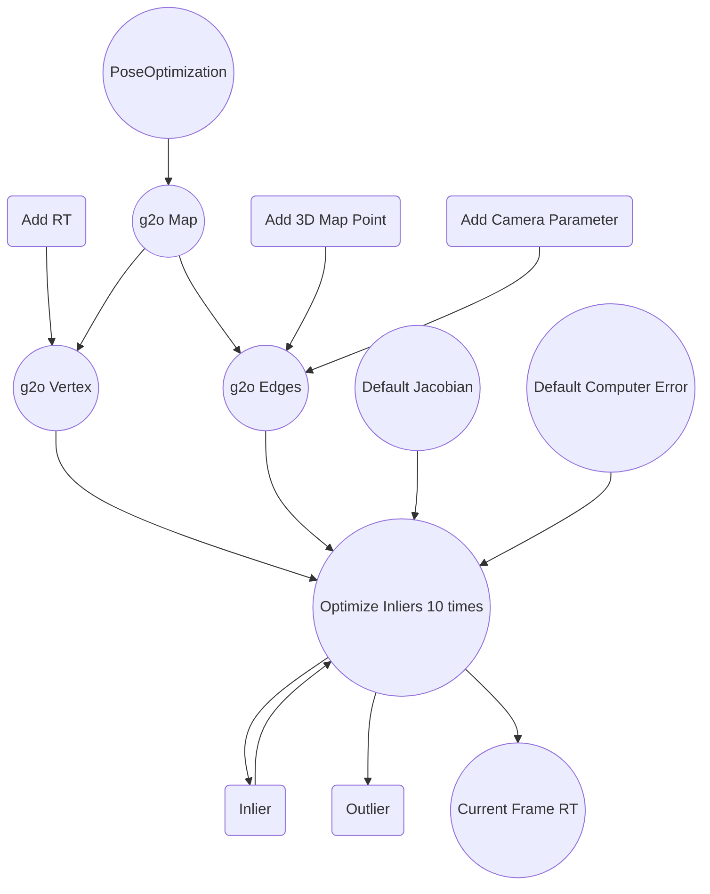

```mermaid
      graph TD
			SearchByBow((SearchByBow)) --> GetBowNode(Get Bow Node from KeyFrame and Frame)
			GetBowNode --> Get2DPointFeature(Get 2D Point Feature from Bow Node of KeyFrame and Frame)
			Get2DPointFeature --> Match2DPoint((Match 2D Point by Orb Descriptors Similarity))
			Match2DPoint --> Assign3DPoint((Assign the Same 3D Point to Frame))
			Assign3DPoint --> RemoveBadPoints(Remove Bad Matches by Similarity and Angle)			
```

```mermaid
      graph TD
			TrackReferenceKeyFrame((Track with Reference Key Frame)) --> ComputeBow(Compute for DBOW)
			ComputeBow --> DBOW
			DBOW((DBOW Search)) --> MatchedMapPoints((Matched Map Points))
			RefKeyFrame((Reference Key Frame)) --> DBOW
			MatchedMapPoints --> PoseOptimization((PoseOptimization))
			LastRT((Last Frame RT)) --> PoseOptimization
			PoseOptimization --> CurrentRT((Current Frame RT))
```

```mermaid
      graph TD
			PoseOptimization((PoseOptimization)) --> Start((g2o Map))
			AddVertex(Add RT) --> Vertex
			Start --> Edge((g2o Edges))
			Start --> Vertex((g2o Vertex))
			AddEdge(Add 3D Map Point) --> Edge
			AddCamera(Add Camera Parameter) --> Edge
			Inlier(Inlier)
			Outlier(Outlier)
			Optimize((Optimize Inliers 10 times))
			Vertex --> Optimize
			Edge --> Optimize
			Optimize --> Inlier
			Inlier --> Optimize
			Optimize --> Outlier
			LinearizeOplux((Default Jacobian)) --> Optimize
			ComputerError((Default Computer Error)) --> Optimize
			Optimize --> CurrentRT((Current Frame RT))
```
